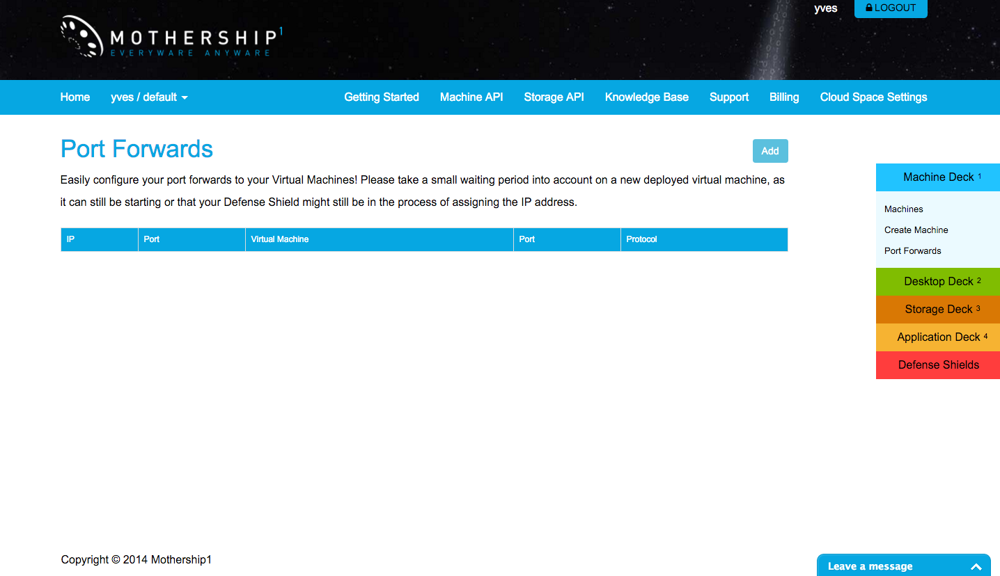
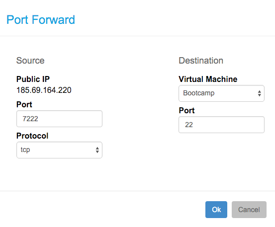
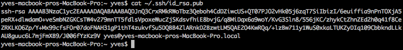

# Connect over SSH to your virtual machine

## Port forwarding

Make sure you know the IP address of you virtual machine. For a virtual machine hosted locally with VirtualBox see above.

For a machine hosted at Mothership1.com, the IP address should be visible on the Manage Machine page, this address is however not reachable publicly. To make the virtual machine remotely accessible, you first need to configure port forwarding.

Clicking on the right navigation bar  **Port Forwards** under **Machine Deck** will bring you to Port Forwards:



Click the **Add** button and configure a port forward for port 22 making the virtual machine accessible for SSH connections on a public IP address. In this case on port 7222 on 185.69.164.220:



## Setup a SSH session

Download and install a terminal emulator on your host operating system, such as for instance iTerm2 for Mac OS: https://www.iterm2.com/

From your terminal emulator setup a ssh connection by typing, `ssh %username%@%ipaddress%`.

If your virtual machine is hosted locally with VirtualBox this will look like:

```
ssh yves@192.168.56.102
```

And in case of the virtual machine hosted by Mothership1.com:

```
ssh cloudscalers@185.69.164.220 -p 7222
```

In both cases you will be asked to enter password:
 * For a virtual machine hosted locally with VirtualBox you've created this password yourself as part of the installation
 * When you are using Mothership1 the password and the username are displayed in the **Manage Machine** page

## Copy public key

Optionally, in order to not always having to enter your password, we can copy your personal public key to the Ubuntu virtual server

Open a new local terminal session, and verify whether you already have a public and private key pair:

```
cat ~/.ssh/id_rsa.pub
```

In case you already have a private/public key pair, you should see something like:



When needed you will want to create your key pair with following command:

```
ssh-keygen -t rsa
```

Accept the default location to generate the keys

In order to copy your public key `id_rsa.pub` (not your private key `id_rsa`) to the clipboard type:

```
pbcopy < ~/.ssh/id_rsa.pub
```

Open a ssh session with your Ubuntu server, depending on whether you chose a VirtualBox or a Mothership1.com hosted virtual machine you do this like this:

```
ssh yves@192.168.58.102
```

or:

```
ssh cloudscalers@185.69.164.220 -p 7222
```

Now get root access:

```
sudo -i
```

Enter your Ubuntu server password.

Goto the hidden `.ssh` directory

```
cd .ssh
```

Create and open a new file `authorized_keys` via vi:

```
vi /.ssh/authorized_keys
```

Enter insert mode by hitting `i` and then paste the public key from the clipboard with `ctrl + v`.

Hit `esc` and then type `:wq` to save the file and quit vi.

Exit root access:

```
exit
```

Exit the SSH session:

```
exit
```

Reopen a SSH session with root access:

```
ssh root@192.168.51.102
```

or in case your your server is hosted at Mothership1.com:

```
ssh root@185.69.164.220 -p 7222
```

You should have immediate root access without having to enter your Ubuntu server password.
