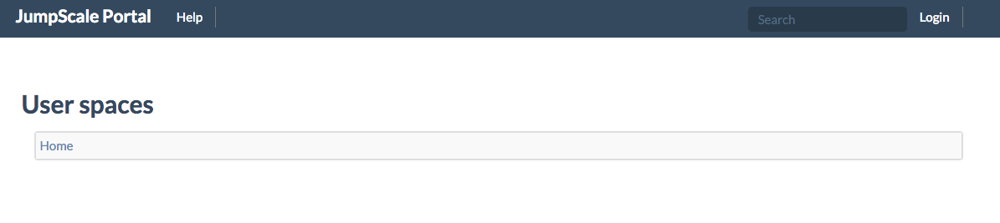
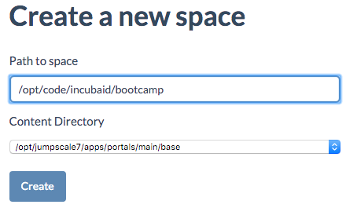
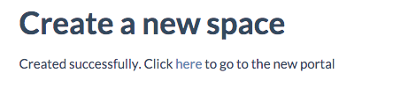
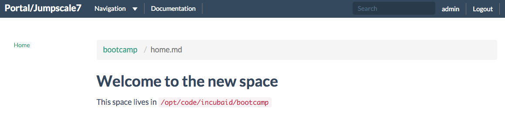
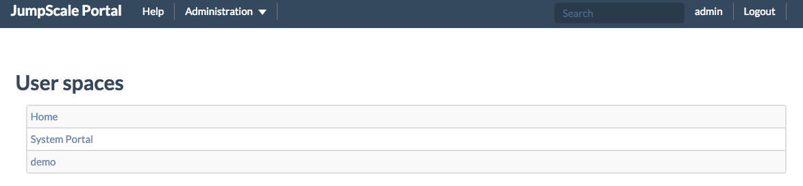
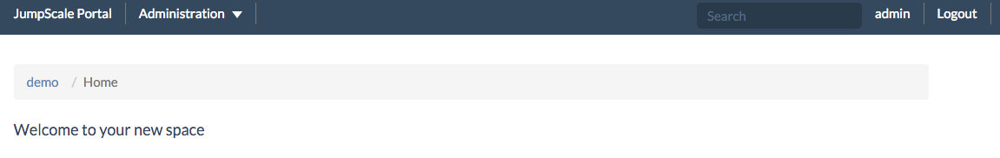
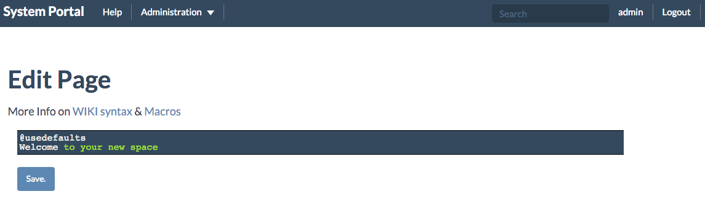

# Getting acquainted with JumpScale

## Install the JumpScale Portal

Installation of the single node portal only takes takes one command with At Your Server (AYS):

```
ays install -n singlenode_portal
```

Check the port on which the freshly installed portal is listening:

```
netstat -nl
```

You should see the your server is listening is on port 82, on all interfaces:

```
Proto Recv-Q Send-Q Local Address           Foreign Address         State
tcp        0      0 0.0.0.0:82              0.0.0.0:*               LISTEN
```

Also by typing `ays status` you will see that the portal is currently running:

```
DOMAIN          NAME                 Instance   Prio Status   Ports
======================================================================

jumpscale       redis                system        1 RUNNING  9999
jumpscale       influxdb             main          5 RUNNING  8083, 8086
jumpscale       mongodb              main          5 RUNNING  27017, 28017
jumpscale       osis                 main         10 RUNNING  5544
jumpscale       portal               main         20 RUNNING  82
```

You will see that the portal is by default active on port 82.

If your virtual machine is running locally on VirtualBox, you can test the portal in your browser, simply visit http://192.168.56.101:82 or whatever other address on which your virtual machine is active on the host-only adapter.

You should see the default JumpScale portal:



, for which you probably will want to configure a port forwarding.

In case you have chosen to run your remote virtual machine on Mothership1.com you will first need to configure an additional port forwarding by clicking the **Add** button on the Port Forwards page and specifying the following configuration:


Once this is done, you can easily test the portal:

```
http://185.69.164.220:7282
```

You should see the exact same default page as shown above.


## Login into the JumpScale portal

The initial login credentials are:
 * Username:  admin
 * Password: rooter

## Create your first wiki space

Creating a wiki space can be done in two ways:

 * Via the portal UI
 * Via the command line on the created machine

### Create a wiki space via UI
- Go to Administration on the top bar
- Select "Create Space"



- Replace www_spacename with the name of your space
- Select the directory location where you want to have the wiki space to be created
- Hit the Create button



When you click the **here** hyperlink you will navigate to the home page of your newly created wiki space:



### Create wiki space via command line interface

You can also create a Wiki space via the command prompt.

If not the case, first get root access:
```
sudo -i
```

Start by going to the portal directory:
```
cd /opt/jumpscale7/apps/portals/main/base
```

Create a new directory for your wiki space, including a hidden subdirectory `.space`:
```
mkdir -p demo/.space
```

Simply by doing so the newly created wiki page will already appear on the home page of your portal, where all the user spaces are listed:



When you click the newly listed "user space" **demo** you will navigate to the home page of your new wiki page:



At the command line let us now make the newly created demo directory current and investigate what it contains:

```
cd demo
ls
```

As you can see at this level only one file got created: `Home.wiki`.

At the command line you will discover that the page definition is quite straight forward at this point, type 'cat Home.wiki' and you will see `@usedefaults Welcome to your new space`.

Back in the browser you will see the exact same page definition by selecting the **Edit Page** from the **Administration** menu:



Now let's dive a little deeper by going to the hidden `./space` directory:

```
cd .space
ls
```

As you will discover here following files automatically got created by JumpScale:

 * **acl.cfg** - here you define the user rights
 * **default.wiki** - defining the default settings, such as the sections that each page of the space will contain
 * **main.cfg** - only allows you to change te name of wiki space
 * **nav.wiki** - defines the navigation
 * **notfound.wiki** - defines what will be shown in case a page cannot be found
 * **template.wiki** - template for each new page

In the `default.wiki` all defaults are defined, as applied in all pages that specify `@usedefaults`, as is the case for `Home.wiki`.

As an exercise open `default.wiki`with vi:
```
vi default.wiki
```

Hit `i` in order to go into insert mode, and change the title from "JumpScale Portal" to "JumpScale Portal Demo", then hit `esc`, enter `:wq` and finally hit `enter`.

As a result you will see that the title in the tab of your browser was changed to "JumpScale Portal Demo" when you refresh the home page of your new wiki space.
