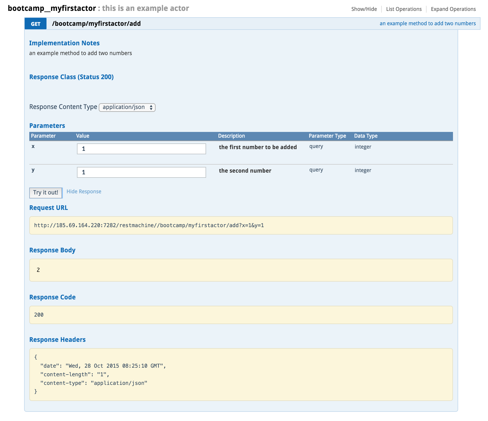

# Create your first actor

As a starter it is recommended to first read the [How to create your first actor](https://gig.gitbooks.io/jumpscale8/content/Portal/Howto/How-to-create-your-first-actor.html) section in the [JumpScale8](https://www.gitbook.com/book/gig/jumpscale8/details) public documentation.

For each actor you need to create sub directory in the `./base` directory, in the same directory where you create a directory per wiki space.

The name of this directory needs to be `<appname>__<actorname>`, and should include a sub director `.actor`, all other files and directories get generated automatically.

Let's create one:

```
cd /opt/jumpscale7/apps/portals/main/base
mkdir -p bootcamp__myfirstactor/.actor
```

Now restart the portal:
```
ays restart -n portal
```

As a result of the restart a new `specs` directory got auto-generated, containing one file `_example__Actor.spec`.

First rename the file `_example__Actor.spec` to any name of your choice, such as `myfirstactor.spec`.

Let's change the code:

```
[actor]
	"""
	this is an example actor
	"""
    method:add
		"""
		an example method to add two numbers
		"""
		var:x int,,the first number to be added
		var:y int,,the second number
		result:int
```

Let's again restart the portal:
```
ays restart -n portal
```

No new files or directories got generated.

Now go to the **API** page on the **System Portal**.

You will see the your new actor listed.

When checking again the directory `bootcamp__myfirstactor`, you will see that a new `methodclass` sub directory got generated. This is where we will actually implement the actor.

```
vi bootcamp_myfirstactor.py
```

Comment out the line raising the not implemented error:
```
#raise NotImplementedError ("not implemented method add")
```

Add following code:
```
return x+y
```

Restart the portal:
```
ays restart -n portal
```

Test your actor in the **API** page of the **System Portal**:


