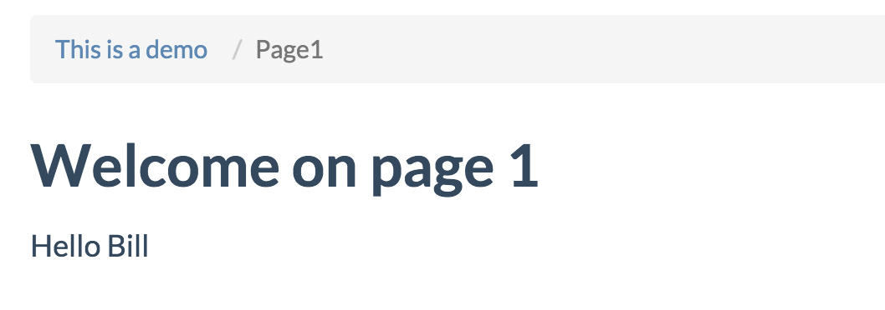

# Create your first macro

In this exercise you will create a macro that is local to your wiki space.

All local macros are stored in the hidden `.macros` directory of your wiki space, so in our case `demo/.macros`.

While system macros, that is macros that are available across all wiki spaces, are not discussed here, it's worthwhile to have a look to the existing system macros and learn from them. You will find them in the `apps/portals/portalbase/macros` directory.

Let's create a simple wiki macro, which basically replaces its body in the wiki page with whatever output you choose.

All wiki macros need to be saved in the sub directory `.macros/wiki`, and for each macro you need to create a sub directory with the name of the macro. The actual file implementing the macro can have any name.

Let's create one:

```
 cd .macros/wiki
 mkdir examplemacro
 vi examplemacro/1_whatevername.py
```

Here's the code:

```
 def main(j, args, params, tags, tasklet):
    name = args.getTag('testnaam')
    out = 'Hello %s' % name
    params.result = (out, args.doc)
    return params
```

In order to test this new macro, edit the Page1.wiki definition, adding:

```
 {{examplemacro testnaam:$$testname}}
```

The portal will need to be restarted after adding a macro:

```
ays restart -n portal
```

In order to test this new macro browse to Page1, but append `?testname=Bill` in the address bar.

You should see following result:


