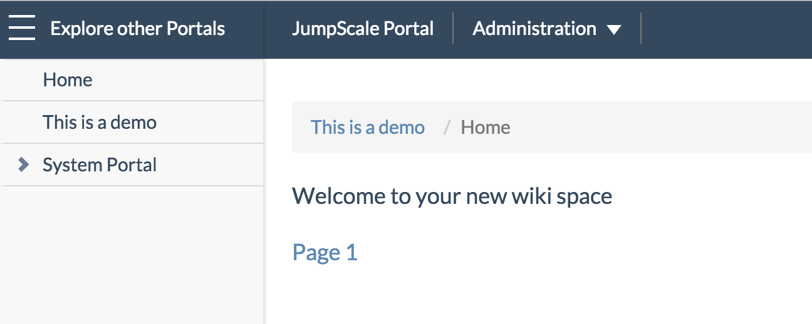
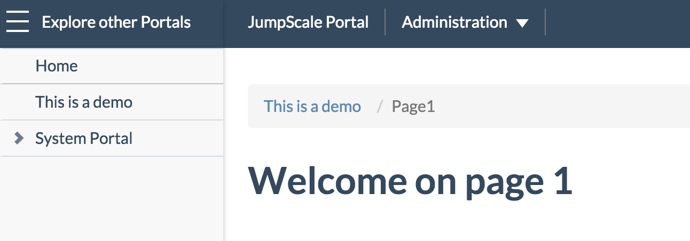

# Create new page via command line interface

```
cd /opt/jumpscale7/apps/portals/main/base/demo
vi page1.wiki
```

Just a following text and save:
```
@usedefaults
h2. Page 1
```

Let's add a hyperlink to the newly created page on the home page:
```
vi home.wiki
```

Add following text and save:
```
[Page 1 | demo/page1]

```

Check in the result in the browser:




