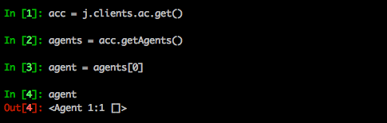
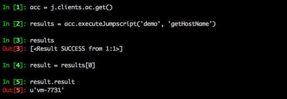

# Executing JumpScripts

First we will install agentcontroller2 and agent2 on your remote machine.

```
ays mdupdate
ays start -n redis
ays install -n agentcontroller2
ays status
ays install -n agent2
```

Specify 1 as the value for both the Grid ID (gid) and Node ID (nid), and just hit enter when asked for the roles.

For now we will work with a single node grid, where both the Agent Controller and the Agent run.

In order to test the installation:

```
ays status
```

```
DOMAIN          NAME                 Instance   Prio Status   Ports
======================================================================

jumpscale       syncthing            controller    1 RUNNING  18384
jumpscale       redis                system        1 RUNNING  9999
jumpscale       influxdb             main          5 RUNNING  8083, 8086
jumpscale       mongodb              main          5 RUNNING  27017, 28017
jumpscale       agent2               main          5 RUNNING
jumpscale       osis                 main         10 RUNNING  5544
jumpscale       agentcontroller2     main         20 RUNNING
jumpscale       portal               main         20 RUNNING  82
```

Let's also enter the interactive JumpScale shell and test the installation:

```
js
acc = j.clients.ac.get()
agents = acc.getAgents()
agent = agents[0]
agent
```

Your output should show the below:



Next let's create a JumpScript to be executed on all nodes.

JumpScripts are saved in `/opt/jumpscale7/apps/agentcontroller2/jumpscripts`, so let's go there and create one:

```
cd /opt/jumpscale7/apps/agentcontroller2/jumpscripts
mkdir demo
cd demo
vi getHostName.py
```

Here's the code:

```
from JumpScale import j

def action():
    return j.system.net.getHostname()
```

Let us first test the script in the JumpScale shell:

```
js
acc = j.clients.ac.get()
results = acc.executeJumpscript('demo', 'getHostName')
results
result = results[0]
result.result
```

You should see following output:


