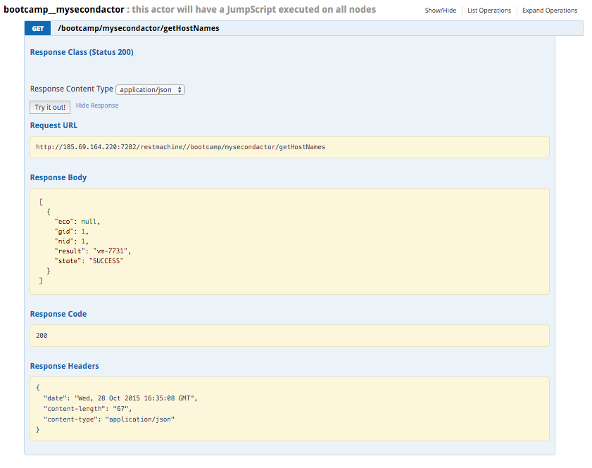

# Executing JumpScripts from an actor

Let's create an actor that executes the above JumpScript.


```
cd /opt/jumpscale7/apps/portals/main/base
mkdir -p bootcamp__mysecondactor/.actor
cd bootcamp__mysecondactor
```

Restart the portal to have the `specs` auto-generated:
```
ays restart -n portal
```

Rename the `spec`file and change the specification:
```
cd specs
mv _example__Actor.spec mysecondactor.spec
vi mysecondactor.spec
```

Use this specification:
```
[actor] @dbtype:mem,redis,fs
        """
        this actor will have a JumpScript executed on all nodes
        """
    method:getHostNames
            """
            Get the host names
            """
        result:list(str)
```

Again restart the portal so we can access the stub on the **API** page of the **System Portal**:

```
ays restart -n portal
```

Now access the stub, so that the new `methodclass` sub directory gets auto-generated.

Let's now implement the `methodclass`:

```
cd methodclass
vi bootcamp_mysecondactor.py
```

Comment out the line raising the not implemented error, and append the actual implementation, basically copying the code we previously tested in the JumpScale shell:
```
#raise NotImplementedError ("not implemented method add")
acc = j.clients.ac.get()
results = acc.executeJumpscript('demo', 'getHostName')
return results
```

Once more, restart the portal:
```
ays restart -n portal
```

Before you continue, test the new actor on the **API** page of the **System Portal**:


