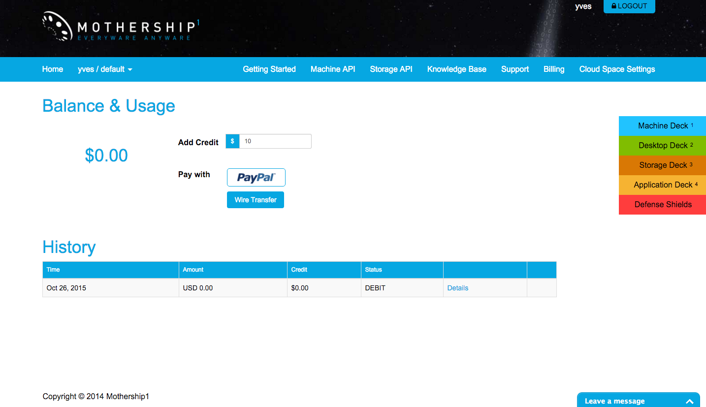
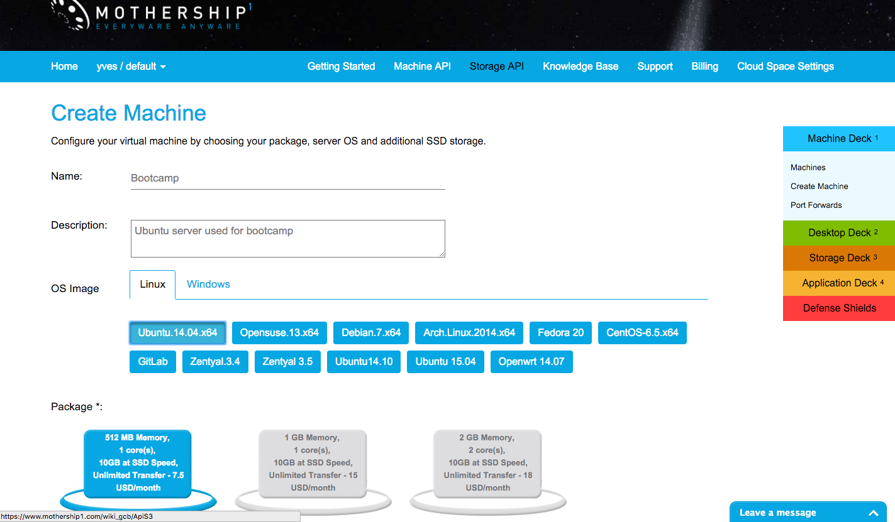

# Create a virtual machine hosted by Mothership1.com

Goto https://www.mothership1.com and signup for for an account.

Once you've created an account you will automatically get signed in. You're screen should look like this:

In order to actual start using online resources, you will want to add credits:

Clicking using the right navigation bar or the Machine Deck icon, will bring you to the Machine Deck:

On the Machine Deck click Create Machine, specify some same and description, select Ubuntu.14.04.x64, acccept all other defaults and click Create.

Once create you will see the Manage Machine page where you will see that you're machine is up and running:

