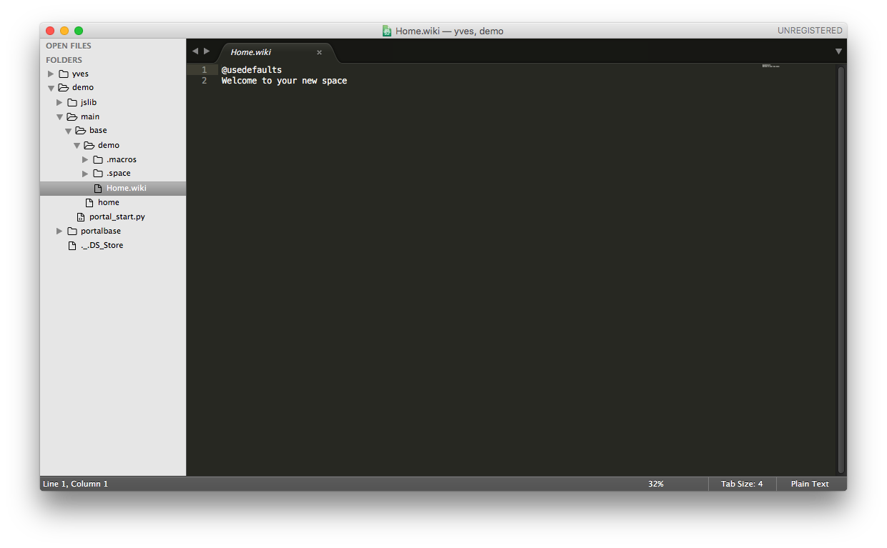
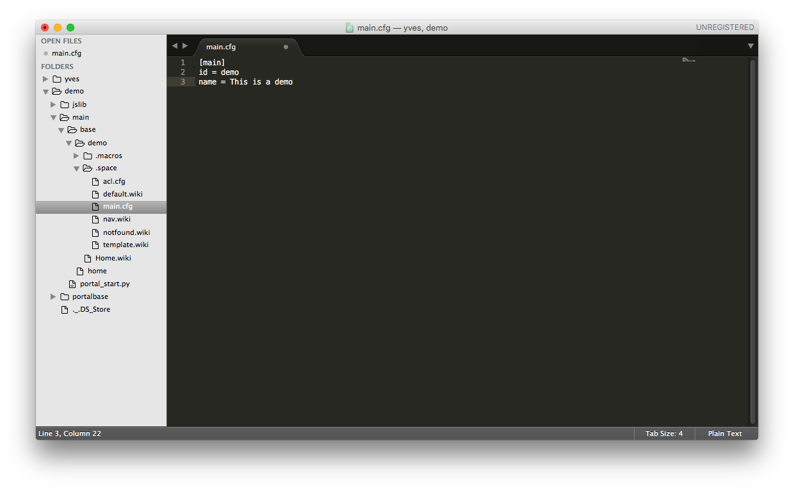
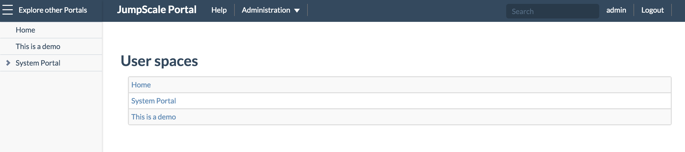

# Configure SSHFS in order to interact more easily with the directories and files

While you might prefer to continue to do all ad hoc editing of the files as shown here above, with vi or vim, it can become quite cumbersome when having to do more elaborate work.

With SSHFS you can mount the remote directories to your local file system and interact with the files as if it were local files, and edit them with tools like Atom or Sumblime Text.

Unless you love to remember and enter passwords, you will first want to copy your public key (`id_rsa.pub`) to the `authorized_keys` on the remote machine:

- If you just need *cloudscalers* access: copy the content of `~/.ssh/id_rsa.pub` on your local machine to `/home/cloudscalers/.ssh/authorized_keys` on the remote machine
- If you require *root* access (most probably): copy the content of `~/.ssh/id_rsa.pub` on your local machine to `/home/root/.ssh/authorized_keys` (requires `sudo -i`) on the remote machine

On your host machine you next need to install FUSE and SSHFS, for Mac OSX go it here: http://osxfuse.github.io

Once installed, create on your host a local directory where you want to mount all remote directories and files:

```
mkdir ~/demo
```

Then in order to actually mount the directories locally, below if you require root access:

```
sshfs root@185.69.164.220:/opt/jumpscale7/apps/portals ~/demo -p 7222
```

The above is for the case that you've been using Mothership1.com and preferred to mount with root access. Best is to match the access level you set when copying your local public key.

Also note that we only mounted the `portals` directory, you can obviously go higher or lower.


## Edit the remote files with Sublime Text

Once you mounted directory, you use an editor like **Sublime Text** to access the remote files. In case of **Sublime Text** select **Add Folder to Project** from the **Project Folder** and select the local folder demo.



Let's edit `main.cfg`, adding one line of text: "`name = This is a demo`":



Save your changes and at the command line restart the portal in order to make your changes effective:

```
ays restart -n portal
```

You will see now that the name of your new wiki space as it appears in the "User spaces" list got changed to "This is a demo":


