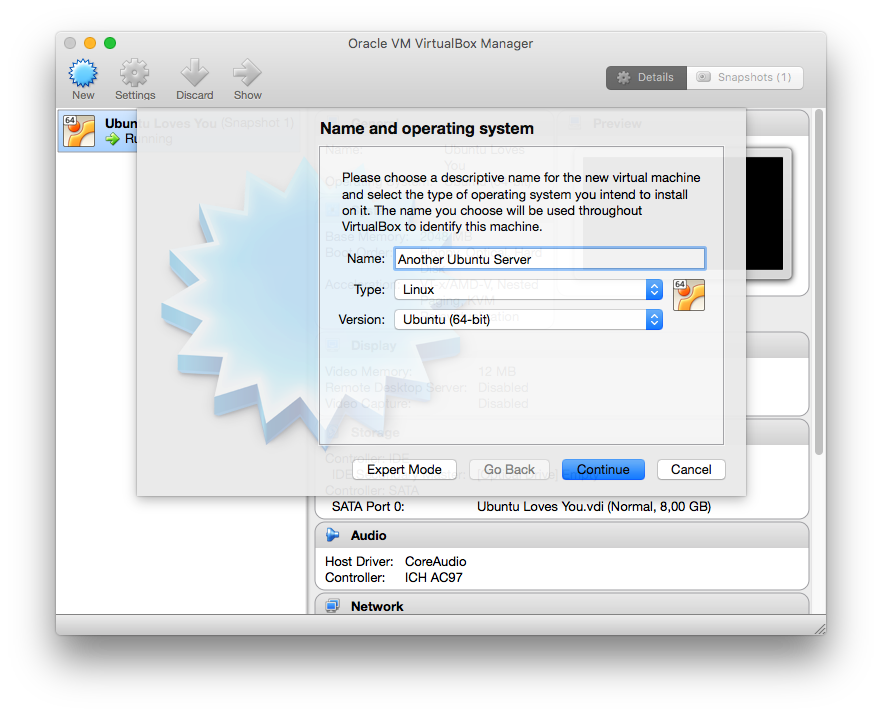
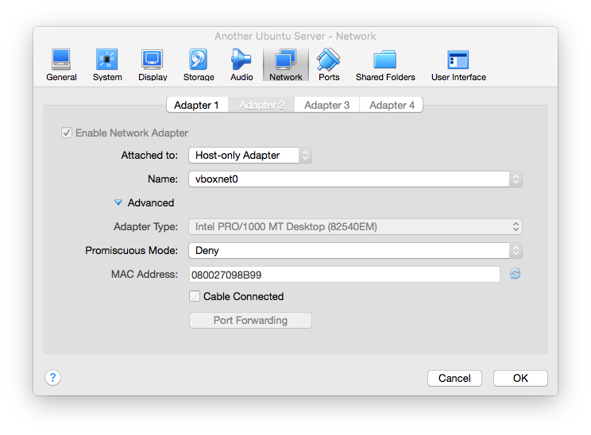
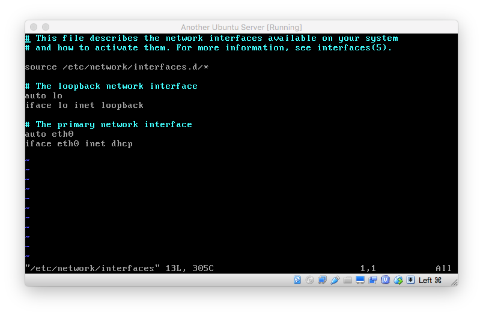
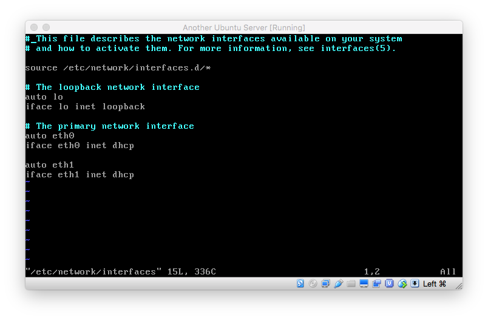
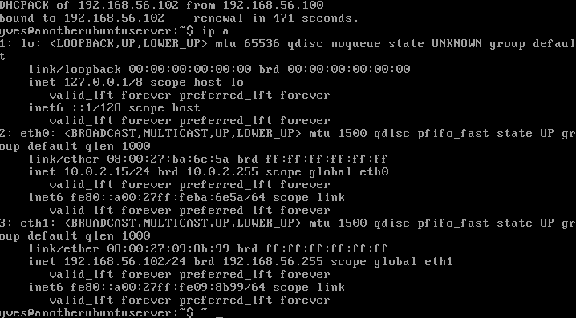

# Installing Linux on a virtual machine hosted locally with VirtualBox

## Install VirtualBox

 * Download VirtualBox 5.0: https://www.virtualbox.org/
 * For the installation steps, accepting the defaults
 * Optionally you can also install the Extension Pack

## Configure VirtualBox

 * Goto VirtualBox > Preferences
 * Under Network select Host-only Networks
 * Create a new host-only network, accepting the defaults

## Install Ubuntu Server

 * Get Ubuntu Server 15.04 from http://http://www.ubuntu.com/download/server
 * Create a new virtual machine in VirtualBox

 
 
 
 
 
 
 

  * Start the newly created server
  * Select the previously downloaded Ubuntu ISO image
  * Select all defaults
  * Give your server a name
  * Specify your real name, user name and password
  * Do not encrypt your hard drive
  * Confirm/set your time zone
  * Specify that you want to use the entire disk when asked about partitioning (default) and accept all other defaults
  * Continue leaving the HTTP proxy information blank
  * Choose to receive no automatic updates
  * Select OpenSSH (space) server from the list of proposed software

  

  * Accept to install the GRUB boot loader to the master boot record (default)
  * Login to your newly booted server
  * Shutdown the newly installed server by typing on the command prompt:

    ```
    sudo shutdown now
    ```

## Add ethernet interface for host-only network

 * First make sure that the newly installed Ubuntu server is shutdown
 * Go to the Network settings of your Ubuntu server
 * Under Adapter 2 select "Enable Network Adapter", and specify the previously created host-only Adapter

 

 * Boot and login to your Ubuntu server
 * At the command prompt type:

     ``sudo vi /etc/network/interfaces``

 * Enter your password, this will open the **interfaces** file in vi
 * The **interfaces** file configures the network interfaces on your Ubuntu server

 

 * Under the  *The primary network interface* section add following to lines:

    ```
    auto eth1
    iface eth1 inet dhcp
    ```

 

 * Hit the `ESC` and then type `:wq` in order saves changes and quite vi
 * Bring the newly added network interface up with the command `sudo ifup eth1`
 * Type `ip a` in order to check that the new added net interface (eth1) is indeed up and see the assigned IP address

 

 * In out case the IP address is 192.168.56.102
