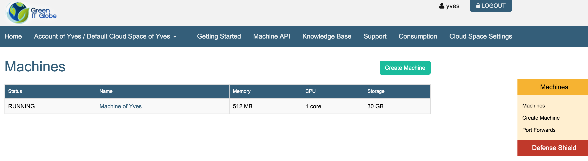
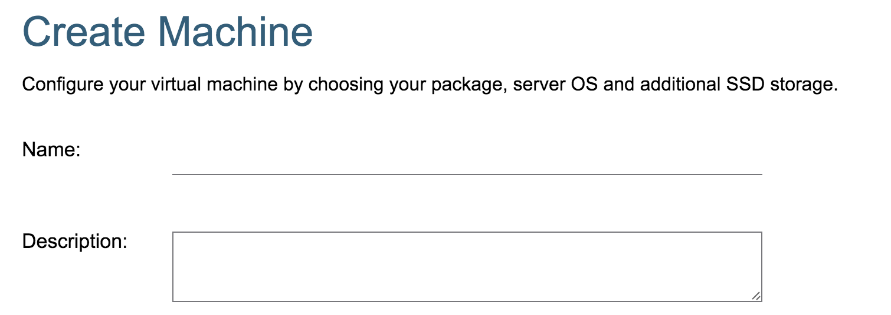
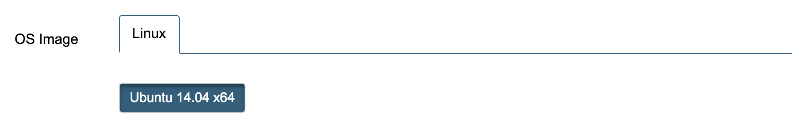

# Machines

## Create Machine

Machine name...

Machine image...

Machine package...

And finally machine disk size...

Result...

## Actions

@todo

## Console

@todo

## Disks

@todo

## Snapshots

@todo

## Change Log

@todo

## Sharing

@todo

## Port Forwards

@todo
