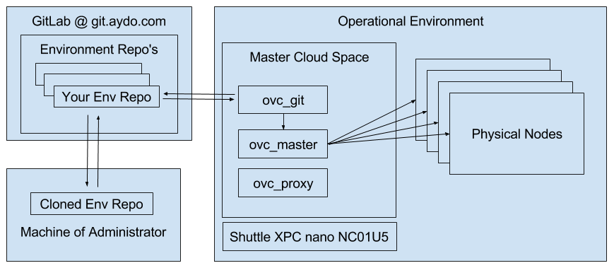

# How to Connect to an Environment

## Introduction



The core of an OpenvCloud environment is the **master cloud space**, which consist of the following docker containers:
- **ovc_git** holding all configuration of your environment
- **ovc_master** controlling the environment based on information from ovc_git
- **ovc_proxy** running nginx as a proxy for all port 80 and port 443 communications

The master cloud space and its containers can run locally, close to the actual OpenvCloud physical nodes it controls or remotely, for instance in another OpenvCloud environment, such as at mothership1.com.

When installed locally, Green IT Globe typically uses the [Shuttle XPC nano NC01U5](http://www.shuttle.eu/products/nano/nc01u5/) Mini-PC.

For each environment managed by Green IT Globe a master git repository is maintained at https://git.aydo.com/ ("AYDO"). The git repository for the environment "be-scale-1" for instance is available at https://git.aydo.com/openvcloudEnvironments/be-scale-1. Access is of course restricted.

On the ovc_git docker container of your environment this git repository is cloned fron the central git environment at AYDO, holding all configuration information, including all the keys in order to access all other docker containers of the master cloud space of your OpenvCloud environment.

So in order to access you OpenvCloud environment you have two options, get direct or indirect access to the git repository:

- **Direct access** requires that you know the credentials for opening an SSH connection to ovc_git
- **Indirect access** (recommended) requires that have the AYDO credentials in order to first clone the git repository of your local machine, providing you  the keys to access ovc_git and all other docker containers in the master cloud space, and update the configuration, which you will be pushing back to the central repository at AYDO, from where it gets in turn pulled to ovc_git, making your changes effective.


## Accessing ovc_git indirectly

For the indirect access, there are some prerequisites, all documented [here](preparing_for_indirect_access.md), explaining:
- How to get access to AYDO
- How to configure your git accounts to use your personal SSH keys for authentication
- How to install and configure git on your personal computer

From a well prepared computer, as documented [here](preparing_for_indirect_access.md), your first step will be to clone the repository from AYDO to your local (virtual) machine:
```
git clone https://git.aydo.com/openvcloudEnvironments/be-scale-1
```

If the repository was already cloned previously on your machines, pull the latest update from the directory where it was cloned previously:
```
git pull
```

Make sure the cloned keys file is protected, not accessible to other users, it should be "rw_ --- ---" (600), not "rw- r-- r--" (644):
```
chmod 600 be-scale-1/keys/git_root
```

So you have the keys, the ip address (instance.public.address) is often (but not allways) the same as the one that can be found in `/opt/code/git/openvcloudEnvironments/$name-of-your-env$/services/jumpscale__docker_client__main`.

Since this address could be different, it's recommended to check with the administrator.

So, for instance for an environment with the name `poc`:
```
cd /opt/code/git/openvcloudEnvironments/poc/services/jumpscale__docker_client__main
cat service.hrd
instance.image.base            = 'openvcloud/2016-01-07'
instance.public.address        = '10.54.16.7'
instance.remote.host           = '172.17.0.1'
instance.remote.port           = '2375'

service.domain                 = 'jumpscale'
service.installed.checksum     = '144240a95f6e30ecaa387133a3a6d2d4'
service.instance               = 'main'
service.name                   = 'docker_client'
```

In order to connect to `ovc_git`, using the git_root identity file (-i) for this environment, and including the -A option (best practice):
```
ssh 10.54.16.7 -l root -A -p 2202 -i /opt/code/git/openvcloudEnvironments/poc/keys/git_root
root@ovcgit:~#
```


## Accessing ovc_master from ovc_git

The public IP address (instance.ip) of ovc_master can be found on ovc_git in `/opt/code/git/openvcloudEnvironments/$name-of-your-env$/services/jumpscale__node.ssh__ovc_master`.

For instance for an environment with the name `poc`:
```
cd /opt/code/git/openvcloudEnvironments/poc/services/jumpscale__node.ssh__ovc_master
cat service.hrd
instance.ip                    = '172.17.0.4'
instance.jumpscale             = 'False'
instance.login                 = 'root'
instance.password              =
instance.publicip              = '10.54.16.7'
instance.ssh.port              = '22'
instance.ssh.publicport        = '9022'
instance.ssh.shell             = '/bin/bash -l -c'
instance.sshkey                = 'ovc_master'

#optional category of service, default = app
service.category               = 'node'
service.description            = 'is a node running linux os'
service.domain                 = 'jumpscale'
service.installed.checksum     = '85a4417a78f8acd43669a1f479bb17b0'
service.instance               = 'ovc_master'
service.name                   = 'node.ssh'root@anotherubuntuserver:/opt/code/git/openvcloudEnvironments/poc/services/jumpscale__node.ssh__ovc_master#
```

The ip address next to `instance.ip` is the one you need, in the above example that is 172.17.0.4.

Connecting to ovc_master from ovc_git is simple then:
```
ssh 172.17.0.4 -A
```


### Accessing physical nodes from ovc_git

All ip addresses (instance.ip) of the physical nodes can be found on ovc_git in `/opt/code/git/openvcloudEnvironments/$name-of-your-env$/services/jumpscale__node.ssh__$name-of-physical-node$/service.hrd`.

For instance for an physical node with the name `be-scale-1-01` in an environment with name `be-scale-1`:
```
cd /opt/code/git/openvcloudEnvironments/be-scale-1/services/jumpscale__node.ssh__be-scale-1-01
cat service.hrd
instance.ip                    = '192.168.103.218'
instance.jumpscale             = 'False'
instance.login                 = 'root'
instance.password              =
instance.ssh.port              = '21001'
instance.ssh.shell             = '/bin/bash -l -c'
instance.sshkey                = 'nodes'

#optional category of service, default = app
service.category               = 'node'
service.description            = 'is a node running linux os'
service.domain                 = 'jumpscale'
service.installed.checksum     = '85a4417a78f8acd43669a1f479bb17b0'
service.instance               = 'be-scale-1-01'
service.name                   = 'node.ssh'root@ovcgit:/opt/code/git/openvcloudEnvironments/be-scale-1/services/jumpscale__node.ssh__be-scale-1-01#
```

Connecting from ovc_git to physical node be-scale-1-01 is as simple as:
```
ssh 192.168.103.218
```
